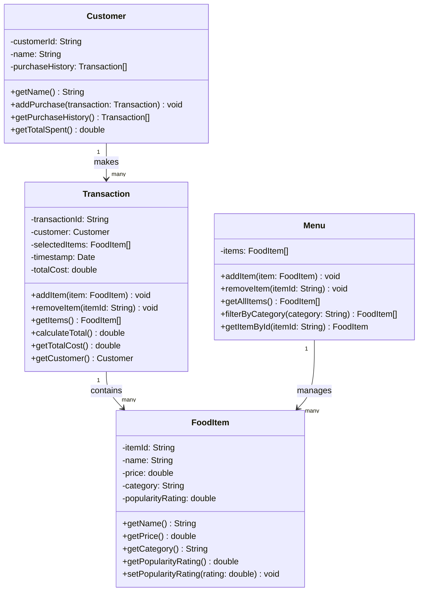

# ByteBites UML Class Diagram

## Class Descriptions

**Customer**: Manages user identity and purchase tracking
- Stores customer ID and name
- Maintains purchase history for user verification
- Provides methods to retrieve transaction history and total spending

**FoodItem**: Represents individual menu items
- Tracks name, price, category, and popularity rating
- Allows popularity rating to be updated dynamically
- Provides access to all item properties

**Menu**: Manages the complete collection of food items
- Stores all available items
- Supports adding and removing items
- Enables filtering by category (e.g., "Drinks", "Desserts")
- Allows lookup by item ID

**Transaction**: Groups selected items into a single purchase
- Links to a customer and their selected items
- Tracks transaction timestamp
- Calculates and stores total cost
- Provides access to transaction details

## Relationships

- **Customer → Transaction** (1 to many): Each customer makes multiple transactions
- **Transaction → FoodItem** (1 to many): Each transaction contains multiple food items
- **Menu → FoodItem** (1 to many): The menu manages all available food items
