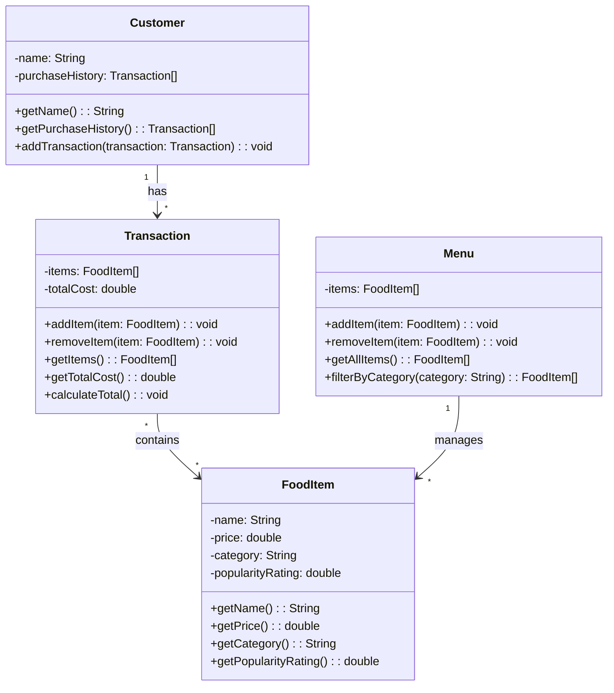

# ByteBites UML Class Diagram

## Key Relationships

- **Customer → Transaction** (1-to-many): Each customer has multiple transactions in their purchase history
- **Transaction → FoodItem** (many-to-many): Each transaction contains multiple food items
- **Menu → FoodItem** (1-to-many): The menu manages all available food items with filtering capability
